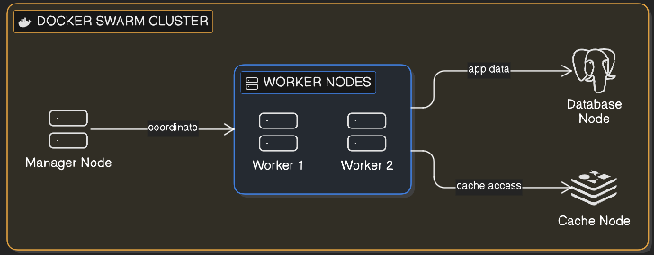
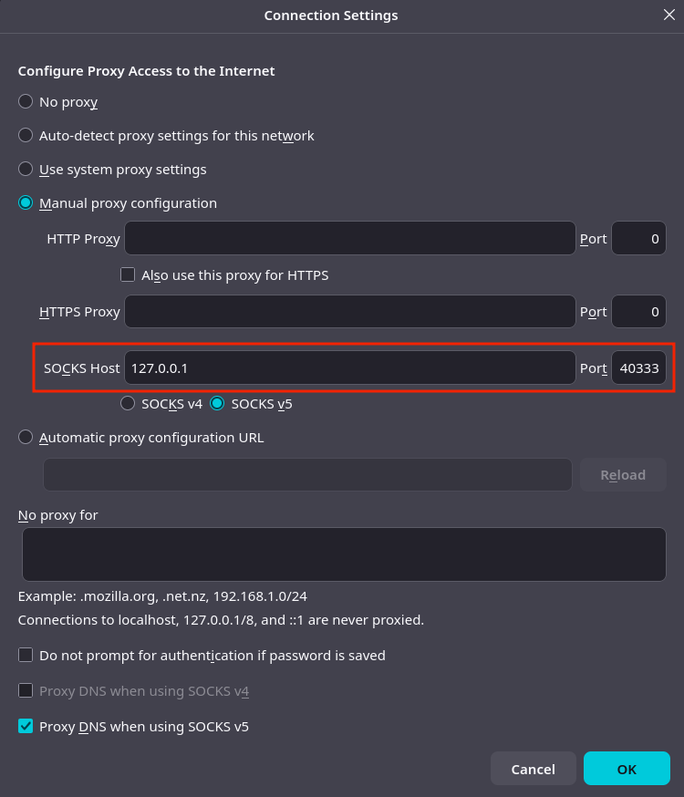

## About

Minimal FastAPI application deployed on a Docker Swarm cluster.


## Prerequisites

For demonstration purposes we're going to provision virtual machines using [Lima](https://github.com/lima-vm/lima) to set the Docker Swarm cluster on multiple nodes. You can use any other virtualization tools such as VirtualBox, VMWare etc. The goal of the project is to provide a straightforward way to deploy and maintain a minimal FastAPI application on a Docker Swarm cluster.


## Navigation

- [About](#about)
- [Prerequisites](#prerequisites)
- [System Requirements](#system-requirements)
- [Project Features](#project-features)
- [Project Structure](#project-structure)
- [Docker Swarm Cluster Setup](#docker-swarm-cluster-setup)
- [Configuration](#configuration)
- [Deployment](#deployment)
- [CLI Snippets](#cli-snippets)
- [Further Steps](#further-steps)
- [References](#references)


## System Requirements
- Python >=3.12,<3.13
- Docker v1.12+ (for Docker Swarm Mode support)
- (*Optional*) Virtualization Tool such as Lima/VirtualBox/VMWare etc.


## Project Features
- FastAPI + Pydantic
- Alembic for managing database migrations
- JSON logging
- Ruff for linting, Ty for type checking
- Pytest for testing
- Pre-commit hooks to perform actions (formatting, testing etc.) before pushing code to the repository
- Deploy to Docker Swarm multi-node cluster
- Configs and Secrets management using Docker capabilities
- VMs provisioning with Lima
- Integration with Portainer for Docker Swarm cluster monitoring


## Project Structure
```bash
.
├── assets
│   └── images              # Project images and diagrams for documentation
├── configs
│   ├── api.env             # Docker Config providing application configuration
├── secrets
│   ├── db_password.txt     # Docker Secret to store the database password
├── src
│   ├── alembic             # Configuration for Alembic. Database migrations and files
│   │   ├── ...
│   ├── app
│   │   ├── main.py         # Main FastAPI application entrypoint
│   │   ├── core            # Core application providing shared resources such as settings, schemas, models etc.
│   │   │   ├── ...
│   │   └── users           # Application to manage users on the API level
│   │       ├── ...
│   └── tests               # Project tests
│       ├── ...
├── compose.yml             # Compose file to deploy the application to Docker Swarm cluster
├── logging.config.json     # Logging configuration for the API
├── lima.sh                 # Custom script to provision virtual machine for Docker Swarm deployment
├── Dockerfile              # Project Docker image builder
├── Makefile                # Project Management commands
├── .env                    # File to dynamically configure compose services
├── .pre-commit-config.yaml # Pre commit hooks
├── pyproject.toml          # Project configuration and dependencies management
└── uv.lock                 # Locked project management file
├── README.md               # Project documentation
```


## Docker Swarm Cluster Setup

Basic architecture for our Docker Swarm cluster is

<p>
  
</p>


### Step 1. Provision VMs (nodes) for the Docker Swarm cluster:

**Note**: skip this step if you don't use Lima for provisioning VMs.

```bash
sudo chmod +x ./lima.sh
./lima.sh manager,worker1,worker2,db,cache
```

### Step 2. Init Docker Swarm cluster:

Initialize Docker Swarm cluster on the Manager node:
```bash
limactl shell manager docker swarm init
```

Copy the join token and address of the Manager node from the output into variables for further steps:
```bash
TOKEN=<docker-swarm-join-token>
MANAGER_ADDR=<manager-node-address>
```

### Step 3. Join nodes to the cluster:

```bash
limactl shell worker1 docker swarm join --token $TOKEN $MANAGER_ADDR
limactl shell worker2 docker swarm join --token $TOKEN $MANAGER_ADDR
limactl shell db      docker swarm join --token $TOKEN $MANAGER_ADDR
limactl shell cache   docker swarm join --token $TOKEN $MANAGER_ADDR
```

List cluster nodes:

```bash
limactl shell manager docker node ls
```

### Step 4. Label nodes (for further deployment):


There are 2 labels:
  - **tag**  - label for tagging nodes to deploy specific services on;
  - **type** - general label used for Portainer to deploy the agent on each node of the stack.


```bash
# connect to the Manager node
limactl shell manager

# label nodes
docker node update --label-add type=fastapi-stack --label-add tag=manager lima-manager
docker node update --label-add type=fastapi-stack --label-add tag=worker  lima-worker1
docker node update --label-add type=fastapi-stack --label-add tag=worker  lima-worker2
docker node update --label-add type=fastapi-stack --label-add tag=db      lima-db
docker node update --label-add type=fastapi-stack --label-add tag=cache   lima-cache
```


## Configuration

Configuration of the entire stack relies on:
  - environment variables - for configuring Docker Swarm services;
  - Docker [Secrets](https://docs.docker.com/engine/swarm/secrets/) - for managing sensitive information such as passwords;
  - Docker [Configs](https://docs.docker.com/engine/swarm/configs/) - for managing regular configuration of the application.

**Step 1**: configure Docker Swarm services ([compose.yml](compose.yml)) via <ins>.env</ins> file. Run the following command to generate one:
```bash
make compose-config
```

It will generate the <ins>.env</ins> file in the root project directory. Adjust the parameters to your environment or project requirements.

**Step 2**: set *Secrets* for storing sensitive information inside Docker Swarm services.

According to the [Secrets](https://docs.docker.com/engine/swarm/secrets/) management in Docker, each parameter should be stored in a separate file inside [./secrets/](./secrets/) directory, and then referenced in the [compose.yml](compose.yml) file. There's only only **Secret** in the entire stack that stores the database password.

It can be created like this:
```bash
echo "postgres" > ./secrets/db_password.txt
```

**Note**: it's recommended to create the <ins>./secrets/db_password.txt</ins> file and set the password manually.


**Step 3**: set **Config** for storing regular configuration of the web application. 

Similarly to [Secrets](https://docs.docker.com/engine/swarm/secrets/), [Configs](https://docs.docker.com/engine/swarm/secrets/) should be stored in a separate file inside [./configs/](./configs/) directory. There's an application config template you can you to configure the application. Use the command below to generate the application configuration file:
```bash
make app-config
```

It will generate <ins>./configs/api.env</ins> file. Adjust the parameters to your own requirements or leave the default values.

Once all the configuration is set, the stack is ready to be deployed.


## Deployment

Deploy the application stack on the Manager node:
```bash
limactl shell manager make stack-deploy
```

Once the stack is deployed, you can check its status:
```bash
limactl shell manager stack-status
# or
limactl shell manager stack-services
```

If everything's ok, you can ping the API health like this:
```bash
limactl shell manager curl http://127.0.0.1:8000/api/health
```

### Proxy the API to Host:

During development you might want to make the application accessible from the host machine. Follow the steps below to achieve this:

**Step 1**. Create a tunnel for the Manager node:
```bash
limactl tunnel manager
```

The command will output the proxy address (the port is randomly assigned):
```
Set `ALL_PROXY=socks5h://127.0.0.1:<PORT>`, etc.
The instance can be connected from the host as <http://lima-default.internal> via a web browser.
```

**Step 2**. Access the application from your host machine:
```bash
curl --proxy socks5h://127.0.0.1:<PORT> http://lima-manager.internal:8000/api/health
```

**Step 3** (optional). In order to open the application in the browser you have to configure SOCKS5 proxy at 127.0.0.1:<PORT>, then navigate to http://lima-manager.internal:8000/api/health.

The image below shows SOCKS5 proxy configuration for Firefox.

<p>
  
</p>

Note that 40333 is the port that was provided by `limactl tunnel` command.

You can also access the Portainer's UI from the browser of your host machine at [https://lima-manager.internal:9443](https://lima-manager.internal:9443) to monitor your Docker Swarm cluster.


## CLI Snippets

The commands below might be helpful during local development:

```bash
# list the available project commands
make help

# generate new database migrations file
make migrations m="<some-message>"

# apply the database migrations
make migrate

# run checks such as Ruff for linting, Ty for type checking, Pytest for testing
make check

# run the API locally
make run RELOAD=1

# clean internal cached files and directories
make clean
```


## Further steps

- Add a separate service to provide Admin UI for the FastAPI application.

- Add proxy service such as Nginx or Traefik.

- Add basic CI/CD pipeline using Github Actions.

- ...


## References
- [FastAPI](https://github.com/fastapi/fastapi)
- [Lima](https://github.com/lima-vm/lima)
- [Docker Swarm Mode](https://docs.docker.com/engine/swarm/)
