## About

Example of deploying a minimal FastAPI application to Docker Swarm cluster with multiple nodes.


## Prerequisites

For provisioning virtual machines I'm going to use [limactl](https://github.com/lima-vm/lima). Make sure to follow the installation guide.

The infrastructure that we're going to provision is:
  - 1 Manager node
  - 2 Worker nodes
  - 1 Database node


## Provisioning Virtual Machines

### Step 1. Create VM for Manager node:
```bash
limactl create template:docker-rootful --name=manager1
```

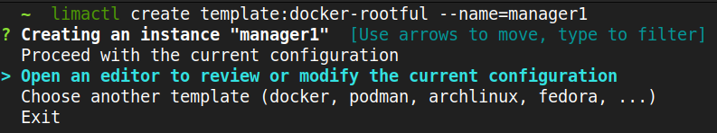

In the interactive menu select *Open an editor to review or modify the current configuration* and specify **networks** attribute (for connectivity between all VMs):
```yaml
networks:
- lima: user-v2
```

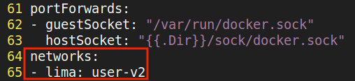

Once succeeded, start the VM like this:
```bash
limactl start manager1
```
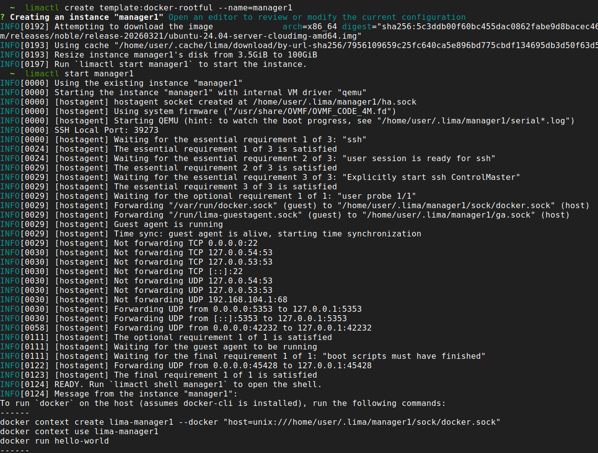


### Step 2. Create VMs for 2 Worker nodes:
```bash
limactl create template:docker-rootful --name=worker1
```


In the interactive menu select *Open an editor to review or modify the current configuration* and specify **networks** attribute (for connectivity between all VMs):
```yaml
networks:
- lima: user-v2
```


Once succeeded, start the VM like this:
```bash
limactl start worker1
```
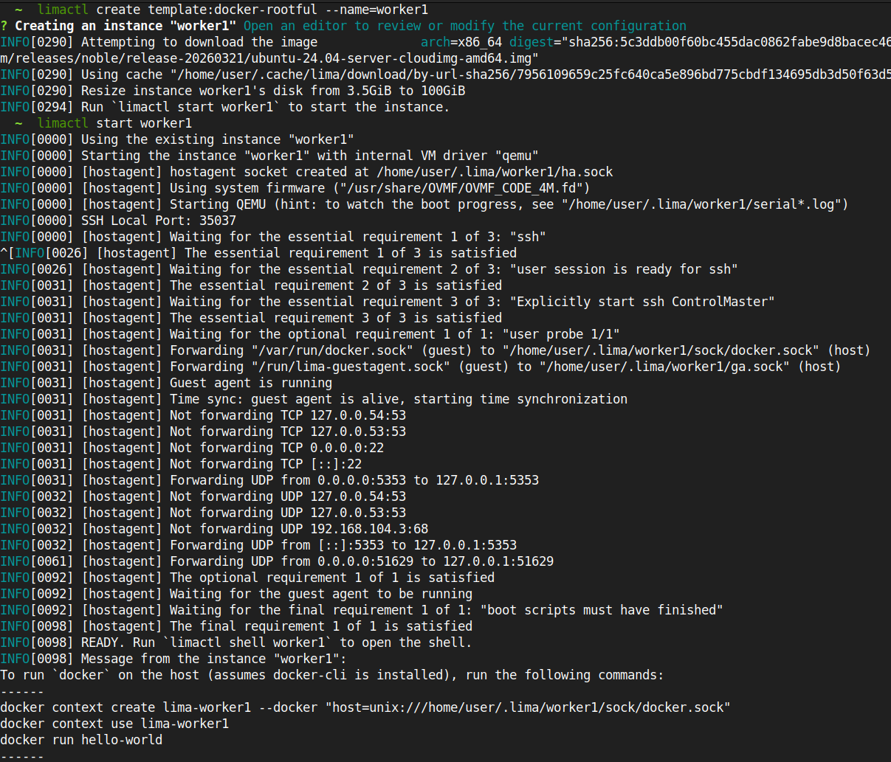


Identically create the second worker (**worker2**).


### Step 3. Create 1 Database node:
```bash
limactl create template:docker-rootful --name=db
```

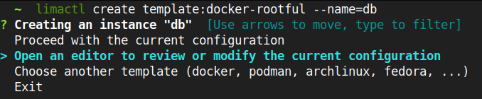

In the interactive menu select *Open an editor to review or modify the current configuration* and specify **networks** attribute (for connectivity between all VMs):
```yaml
networks:
- lima: user-v2
```


Once succeeded, start the VM like this:
```bash
limactl start db
```
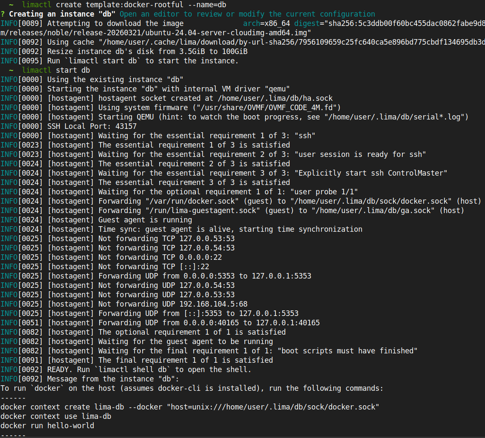

`
Ultimately we've created 4 VMs (1 Manager, 2 Worker, 1 Database):
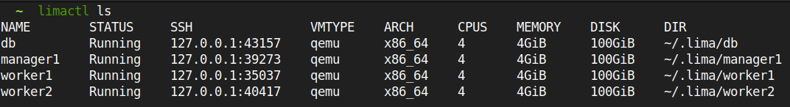


### Step 4. Verify connectivity with the Manager:
First of all obtain the IP address of the Manager node like this:
```bash
limactl shell manager1
hostname -I
```

Next, enter the shell of each node (worker1, worker2 and db) and run `host lima-manager.internal` command to make sure that the received IP Address is the IP address of the Manager node:
```bash
limactl shell worker1
host lima-manager1.internal
```

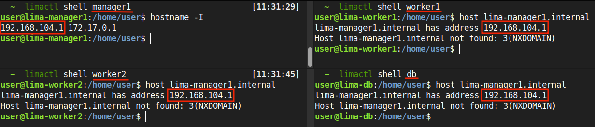

Seems to be working. IP Address of the Manager Node is <ins>192.168.104.1</ins>.

That's it. We've successfully created and connected 4 VMs and now we're ready to provision a Docker Swarm cluster.


## Provisioning Docker Swarm Cluster

After provision VMs, we 're ready to set up our Docker Swarm Cluster.

### Step 1. Init Docker Swarm Cluster on the Manager node

Enter shell of the manager node and initialize Docker Swarm cluster using
```bash
docker swarm init
```

**Note** that <ins>192.168.104.1</ins> is the IP address of the Manager node

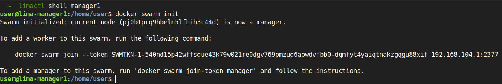

Copy the received token and use it to join the other nodes into the Docker Swarm cluster.


### Step 2. Join the rest of the nodes to the Docker Swarm cluster.

Enter the shell of each node (**worker1**, **worker2** and **db**) and join the Docker Swarm cluster, created on the manager:

```bash
docker swarm join --token SWMTKN-1-540nd15p42wffsdue43k79w021re0dgv769pmzud6aowdvfbb0-dqmfyt4yaiqtnakzgqgu88xif 192.168.104.1:2377
```

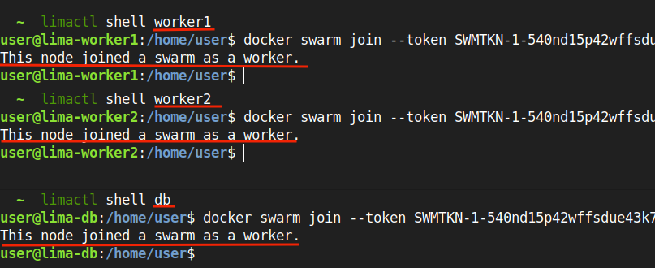


### Step 3. Verify all nodes joined the cluster

Navigate to the manager node and inspect the Docker Swarm cluster using the following commands:
```bash
docker node ls
docker info --format '{{json .}}' | jq '.Swarm'
```

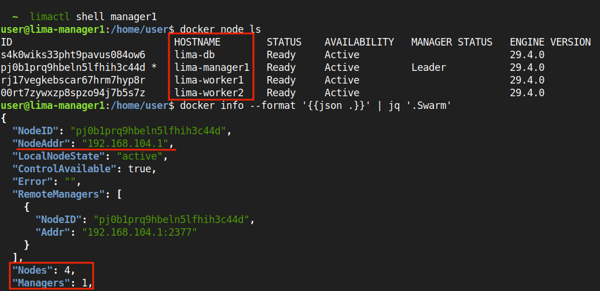


### Step 3. Tag Nodes for further deployment

Before deploying any service to the Docker Swarm cluster, label the nodes to ensure the services are deployed on the corresponding nodes.

Navigate to the Manager node and label the nodes using node's hostname:

```bash
docker node update --label-add TAG=manager manager1
docker node update --label-add TAG=worker lima-worker1
docker node update --label-add TAG=worker lima-worker2
docker node update --label-add TAG=db lima-db
```

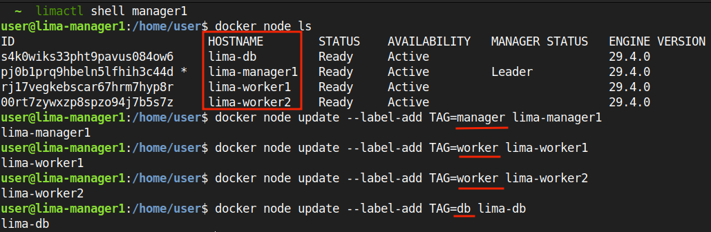

Additionally, you can display a node's tag like this:
```bash
docker node inspect lima-manager1 | jq '.[].Spec.Labels'
```

Once the nodes are labeled, we can deploy our services to a specific node. For example:
```yaml
deploy:
  placement:
    constraints:
      - "node.labels.TAG == db"
```

That's it. Now we're ready to deploy our services to the Docker Swarm cluster.


## Deployment

Deploy the stack:
```bash
docker stack deploy -c compose.yml fastapi-stack 
```


## Snippets
```bash
# generate database migrations
uv run alembic -c src/alembic/alembic.ini revision --autogenerate -m "init commit"

# apply database migrations
uv run alembic -c src/alembic/alembic.ini upgrade head
```


### Docker Swarm Volumes
https://stackoverflow.com/questions/47756029/how-does-docker-swarm-implement-volume-sharing


- When using **volumes** in Docker Swarm mode, these volumes are local to each node by default. So they are not automatically shared across the cluster. Which is challenging to manage. For example, If a task is hosted on the first node then gets redeployed to another node, the data will be lost. To solve this problem Docker Swarm supports storage drivers.
